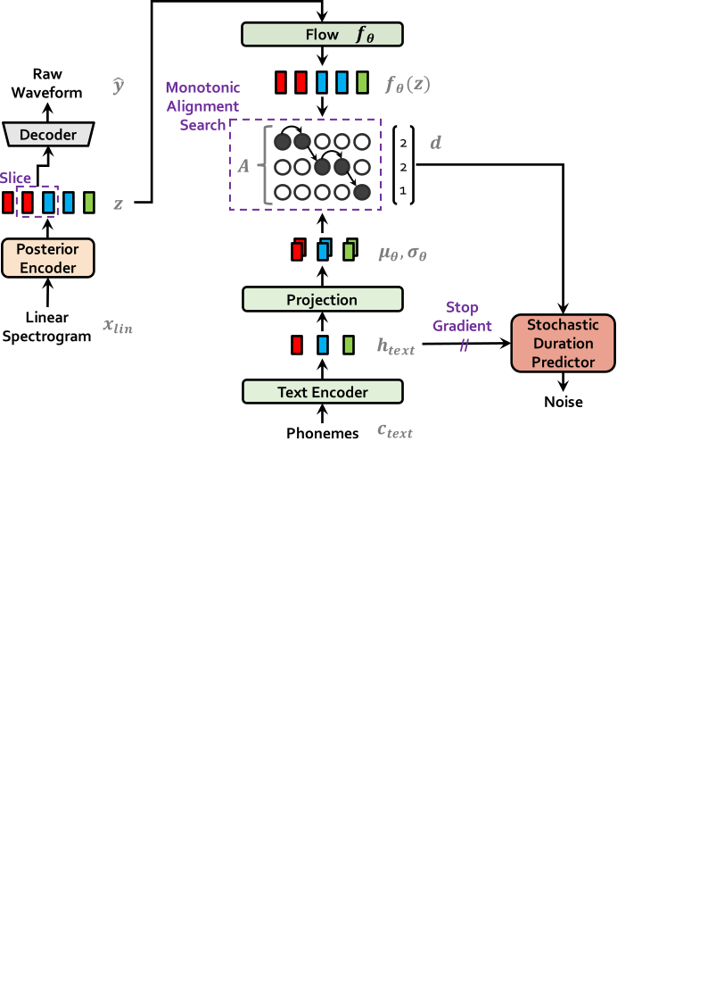
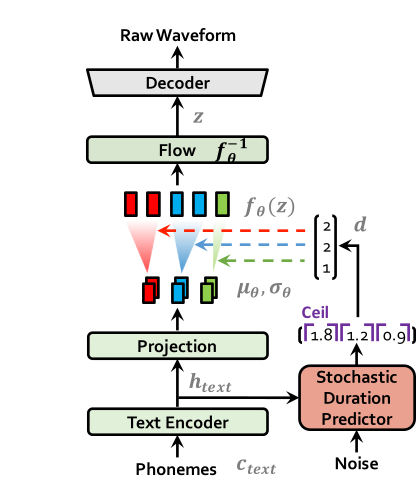

# VITS: Conditional Variational Autoencoder with Adversarial Learning for End-to-End Text-to-Speech
### Jaehyeon Kim, Jungil Kong, and Juhee Son
[Original paper](https://arxiv.org/abs/2106.06103). Several recent end-to-end text-to-speech (TTS) models enabling single-stage training and parallel sampling have been
proposed, but their sample quality does not match that of two-stage TTS systems. In this work, we present a parallel
end-to-end TTS method that generates more natural sounding audio than current two-stage models. Our method adopts
variational inference augmented with normalizing flows and an adversarial training process, which improves the
expressive power of generative modeling. We also propose a stochastic duration predictor to synthesize speech with
diverse rhythms from input text. With the uncertainty modeling over latent variables and the stochastic duration
predictor, our method expresses the natural one-to-many relationship in which a text input can be spoken in multiple
ways with different pitches and rhythms. A subjective human evaluation (mean opinion score, or MOS) on the LJ Speech, a
single speaker dataset, shows that our method outperforms the best publicly available TTS systems and achieves a MOS
comparable to ground truth.

Author's [demo](https://jaywalnut310.github.io/vits-demo/index.html) audio samples. Author's [pretrained models](https://drive.google.com/drive/folders/1ksarh-cJf3F5eKJjLVWY0X1j1qsQqiS2?usp=sharing).

<table style="width:100%">
  <tr>
    <th>VITS at training</th>
    <th>VITS at inference</th>
  </tr>
  <tr>
    <td></td>
    <td></td>
  </tr>
</table>

## Setup environment
```commandline
sudo apt install libsndfile1 espeak
conda env create -f env.yml

conda activate vits
cd monotonic_align
mkdir monotonic_align
python setup.py build_ext --inplace
```
Preprocessing (g2p) for your own datasets. Preprocessed phonemes for LJ Speech and VCTK have been already provided.
```commandline
python preprocess.py --text_index 1 --filelists filelists/ljs_audio_text_train_filelist.txt filelists/ljs_audio_text_val_filelist.txt filelists/ljs_audio_text_test_filelist.txt 
python preprocess.py --text_index 2 --filelists filelists/vctk_audio_sid_text_train_filelist.txt filelists/vctk_audio_sid_text_val_filelist.txt filelists/vctk_audio_sid_text_test_filelist.txt
```

## Training Exmaple

```sh
# LJ Speech
python train.py -c configs/ljs_base.json -m ljs_base

# VCTK
python train_ms.py -c configs/vctk_base.json -m vctk_base
```

## Inference Example

See [inference.ipynb](inference.ipynb)
